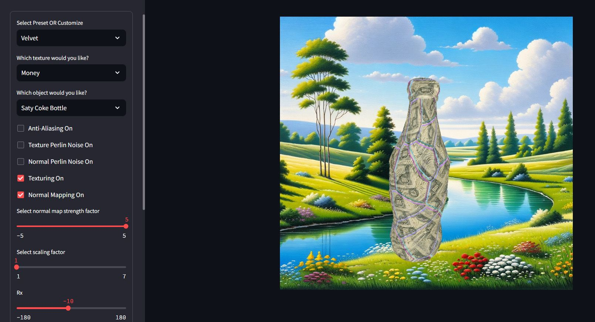

# Project Setup
1. Install a **Python-supported IDE** (Recommended: [VS Code](https://code.visualstudio.com/))
   - Recommended to install Python language-supported extensions:
       - Python, Pylance and Python Debugger
1. Install **[Python 3.8+](https://www.python.org/downloads/)**, 64-bit version
1. Once Python is installed, check your version via `python --version` on the command line
1. Install **Python's Noise library**
   1. Run `pip install noise` or `pip3 install noise`
1. Install **Streamlit 1.33+ (UI Framework)**
   1. Run `pip install streamlit` or `pip3 install streamlit`
   1. Verify your Streamlit version on command line via `streamlit --version`
   
# Running the Project
1. Clone the [repository](https://github.com/CSCI-580-Spring-2024/Final-Project) via:
   1. Command line - `git clone https://github.com/CSCI-580-Spring-2024/Final-Project`
   1. or clone via GitHub desktop
   1. or download as .zip file from the [repository](https://github.com/CSCI-580-Spring-2024/Final-Project)    
1. Within the project directory, open up a command line terminal.
   1. Within VS Code, this would be **Terminal > New Terminal**
   
   1. Example directory: `C:\Users\Person\Desktop\CSCI 580\Final-Project`
1. Run the project within the directory with `streamlit run ./main.py`

1. A new browser window should appear with the application.

